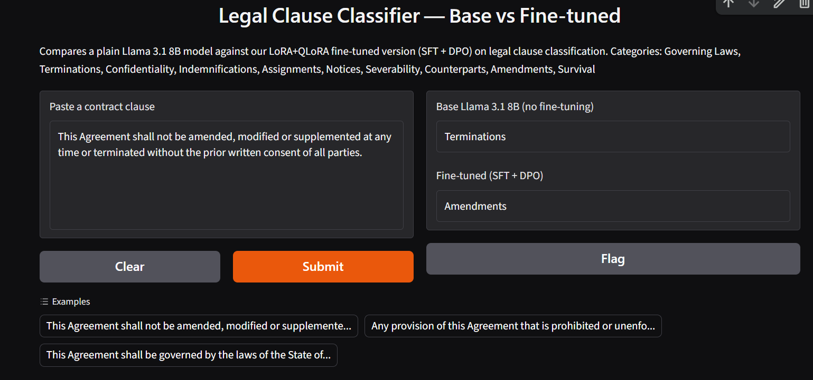
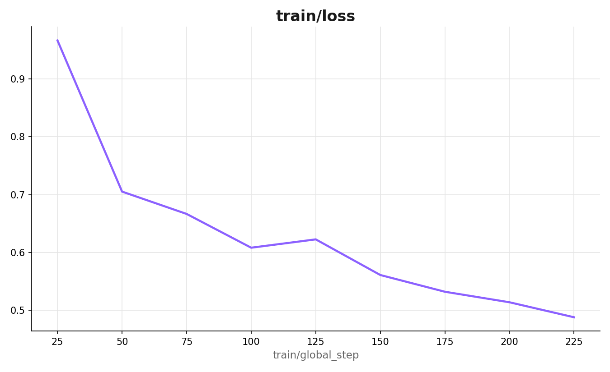
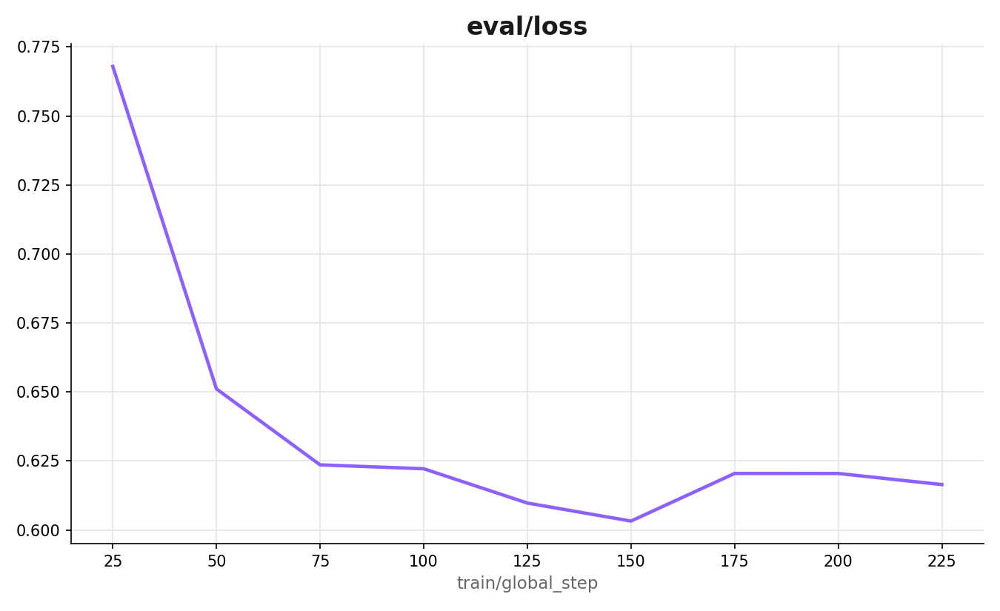
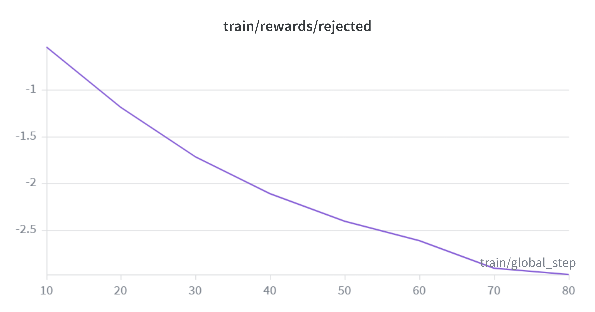
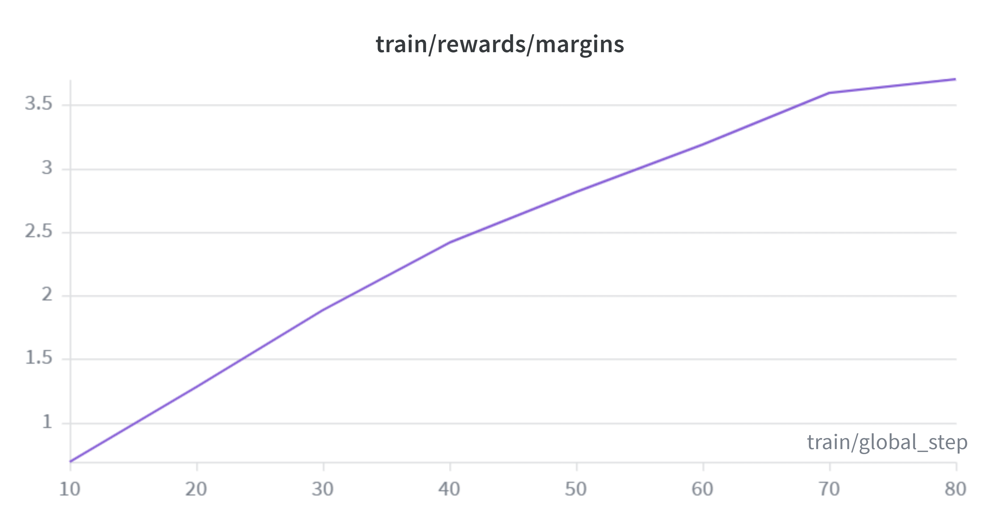
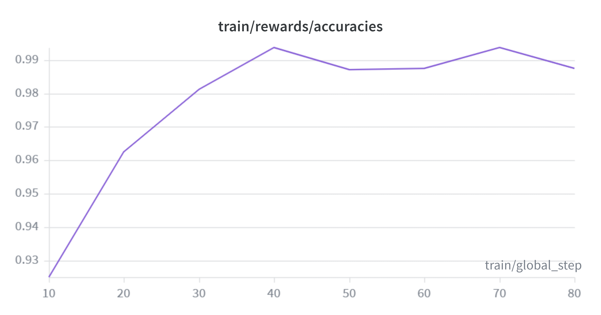
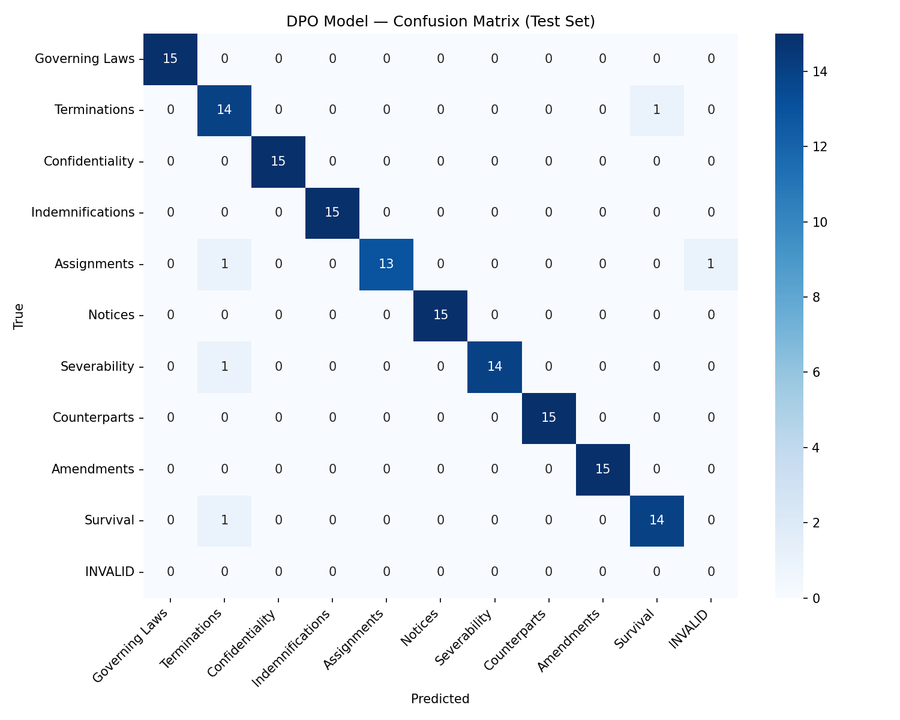

# Legal Clause Classifier — LoRA + DPO Fine-Tuning Pipeline

Fine-tuned **Llama 3.1 8B** on legal contract clause classification using **QLoRA (SFT) + DPO**, improving test accuracy from **94.0% → 97.3%** and achieving **100% accuracy (30/30)** on a handwritten adversarial benchmark — all trained on a single free-tier T4 GPU.

🤗 **Model:** [kaustubh67/llama3.1-8b-legal-clause-classifier](https://huggingface.co/kaustubh67/llama3.1-8b-legal-clause-classifier)

### Live demo



*Real, unmodified output from the evaluation test set — the base model gets fooled by the word "terminated" and predicts `Terminations`; the fine-tuned model correctly reads the clause as governing how the agreement can be modified and predicts `Amendments`.*

Run `05_inference_demo.py` in Colab to launch this demo yourself with a live, shareable public link (Gradio `share=True`).

---

## The problem

Given a raw contract clause, classify it into one of 10 legal categories — the kind of first-pass tagging step used in contract review and due-diligence workflows. A base LLM already does this reasonably well; the goal was to measure exactly how much fine-tuning improves it, and where it still fails.

**10 categories:** Governing Laws, Terminations, Confidentiality, Indemnifications, Assignments, Notices, Severability, Counterparts, Amendments, Survival

## Why fine-tuning (and not just prompting or RAG)

This is a narrow, high-volume, format-sensitive classification task with no need for external facts — a fine-tuned small model gives consistent output format, lower latency, and no per-request API cost or data-privacy exposure (contracts are often confidential). RAG is the better fit for open-ended legal Q&A grounded in statutes/case law; that's a different problem than this one.

## Results

| Model | Test Accuracy (n=150) |
|---|---|
| Base Llama 3.1 8B (no fine-tuning) | 94.0% |
| + SFT (QLoRA) | **97.3%** |
| + SFT + DPO | 96.7% |

- **Edge-case benchmark (30 handwritten adversarial clauses):** DPO model scored **30/30 (100%)**
- **Regression check:** 0 clauses where DPO was correct→wrong vs base; 4 clauses where DPO fixed a base-model error
- **Catastrophic forgetting check:** DPO model still answers general knowledge questions correctly and coherently (capital of France, arithmetic, casual writing) — no observable degradation in general capability

SFT alone edged out DPO slightly on raw test accuracy (97.3% vs 96.7%). This is explained by a diagnostic run during DPO data generation: only 17/700 (2.4%) of DPO preference pairs came from the model's own genuine mistakes — the SFT model was already accurate enough that authentic failures were rare, so most negative examples were rule-based (a random confusable category) rather than organic. DPO's clearer win was **robustness on adversarial cases and zero regressions**, not raw accuracy — a legitimate, expected outcome once a base SFT model is already strong.

### Per-category performance (DPO model)

| Category | Precision | Recall | F1 |
|---|---|---|---|
| Amendments | 1.00 | 1.00 | 1.00 |
| Confidentiality | 1.00 | 1.00 | 1.00 |
| Counterparts | 1.00 | 1.00 | 1.00 |
| Governing Laws | 1.00 | 1.00 | 1.00 |
| Indemnifications | 1.00 | 1.00 | 1.00 |
| Notices | 1.00 | 1.00 | 1.00 |
| Severability | 1.00 | 0.93 | 0.97 |
| Assignments | 1.00 | 0.87 | 0.93 |
| Survival | 0.93 | 0.93 | 0.93 |
| Terminations | 0.82 | 0.93 | 0.88 |

Weakest category is **Terminations** (0.88 F1) — it's the most frequent confusion target for other categories that mention the word "terminated" in passing (see the adversarial example below).

### A real example of what fine-tuning fixed

> *"This Agreement shall not be amended, modified or supplemented at any time or terminated without the prior written consent of all parties."*
>
> **Base model:** `Terminations` (fooled by the word "terminated")
> **Fine-tuned (DPO) model:** `Amendments` ✅ (correctly identifies the clause governs how the agreement can be modified)

## Training curves

**SFT (Supervised Fine-Tuning)**




Train loss: 0.97 → 0.49. Val loss: 0.77 → 0.62, plateauing after ~epoch 1.5–2 (a mild, expected overfitting signature at 3 epochs on 1,200 examples).

**DPO (Direct Preference Optimization)**





DPO reward accuracy (how often the model ranks the correct answer above the incorrect one) climbed from 92.5% → 98%+, with the confidence margin between chosen/rejected growing from 0.69 → 3.70 — the model became substantially more decisive, not just more accurate.

## Confusion matrix (DPO model, test set)



Nearly every misclassification funnels into **Terminations** (from Assignments, Severability, and Survival) — consistent with it having the lowest F1 (0.88). "Terminated"/"termination" appears as incidental language across several clause types, and the model occasionally still keys on that surface signal despite fine-tuning — the same failure mode the adversarial edge cases were designed to catch.

## Method

### 1. Dataset
- Source: [LEDGAR](https://huggingface.co/datasets/coastalcph/lex_glue) (via `lex_glue`), real contract clauses from SEC filings, CC-BY-4.0
- Narrowed from 100 → 10 frequent, semantically distinct categories
- 150 examples/category, deduplicated → **1,500 total**
- Stratified split: **1,200 train / 150 val / 150 test** (test set never touched until final evaluation)
- **30 handwritten adversarial edge cases**, each designed to bait keyword-matching shortcuts (e.g. a Survival clause that mentions "termination")

### 2. SFT — Supervised Fine-Tuning
- **Base model:** `unsloth/Meta-Llama-3.1-8B-Instruct-bnb-4bit`
- **Method:** QLoRA — 4-bit base model (BitsAndBytes) + LoRA adapters (r=16, α=16, all-linear target modules), trained via [Unsloth](https://github.com/unslothai/unsloth)
- **Trainable params:** 41.9M / 8.07B (0.52%)
- 3 epochs, effective batch size 16, LR 2e-4, ~48 min on a single T4
- Tracked in Weights & Biases

### 3. DPO — Direct Preference Optimization
- Built 700 preference pairs from the SFT model's own outputs: sampled the model at temperature 0.7 and used genuine model mistakes as `rejected` examples where they occurred, falling back to a rule-based confusable-category negative otherwise (2.4% real mistakes / 97.6% fallback — see Results above for why)
- Trained with TRL's `DPOTrainer`, β=0.1, LR=5e-6, 2 epochs, 88 steps, ~61 min on T4
- Final training loss: 0.143

### 4. Evaluation
- Base vs SFT vs DPO evaluated identically on the same 150-example test set and 30-example edge-case set
- Confusion matrix, per-class precision/recall/F1
- Regression analysis (DPO vs base, example-by-example)
- LLM-as-judge (Groq, `openai/gpt-oss-120b`) blind-scored a 20-clause sample, 1–5 scale
- Qualitative catastrophic-forgetting check on unrelated general-knowledge prompts

### 5. Deployment
- LoRA adapter merged into the base model (16-bit) via Unsloth, published to Hugging Face Hub
- Live A/B demo built with Gradio, comparing base vs fine-tuned side-by-side on the same clause

## Tech stack

`Python` · `PyTorch` · `Unsloth` · `Hugging Face Transformers/PEFT` · `TRL (SFTTrainer, DPOTrainer)` · `BitsAndBytes` · `Weights & Biases` · `Groq (LLM-as-judge)` · `Gradio` · `scikit-learn`

## What this doesn't do

This is a narrow classifier, not a legal assistant — it labels clause *type*, it does not answer legal questions, assess enforceability, or provide legal advice. That's a fundamentally different problem (open-ended legal reasoning grounded in statutes/case law), typically better solved with RAG rather than fine-tuning.

## Honest limitations / future work

- No full hyperparameter sweep was run (rank/LR/epoch grid) due to free-tier GPU constraints — a single well-justified QLoRA config (r=16, α=16, LR 2e-4) was used throughout, following common defaults
- DPO's marginal accuracy contribution was small given how strong the SFT model already was; a harder base model or noisier initial SFT stage would likely show a larger DPO effect
- No persistent, always-on hosted inference — demo runs on-demand via Gradio in Colab, a deliberate zero-cost-infrastructure tradeoff; the model itself is permanently available via Hugging Face Hub
- Containerized packaging (Docker) not included in this iteration

## Repository structure

```
├── 01_build_dataset.py           # LEDGAR → balanced, formatted, split dataset
├── 02_sft_training.py            # QLoRA SFT training
├── 03a_generate_dpo_pairs.py     # Build chosen/rejected preference pairs
├── 03b_dpo_training.py           # DPO alignment training
├── 04_evaluation.py              # Base vs SFT vs DPO evaluation + analysis
├── 05_inference_demo.py          # Merge, publish to HF Hub, Gradio demo
├── evaluation_results.json       # Full evaluation output (all predictions, scores)
└── assets/                       # Training curves, confusion matrix, demo screenshot
```
